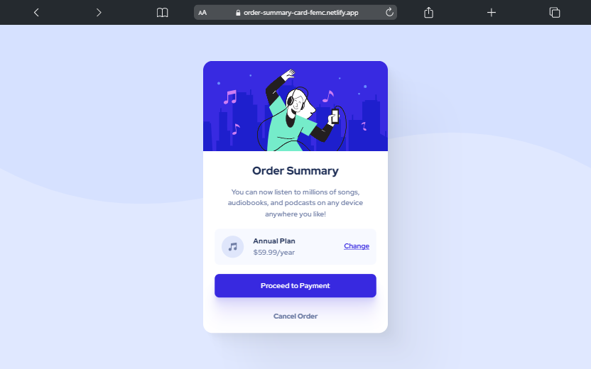

# Frontend Mentor - Order summary card solution

This is a solution to the [Order summary card challenge on Frontend Mentor](https://www.frontendmentor.io/challenges/order-summary-component-QlPmajDUj).

## Table of contents

- [Overview](#overview)
  - [Links](#links)
  - [Screenshot](#screenshot)
- [My process](#my-process)
  - [Built with](#built-with)
  - [Useful resources](#useful-resources)
  - [Author](#author)

## Overview

### The challenge

Users should be able to:

- See hover states for interactive elements

### Links

- Solution URL: [URL here](https://www.frontendmentor.io/solutions/responsive-order-summary-card-wMt1l95W1D)
- Live Site URL: [URL here](https://order-summary-card-femc.netlify.app/)

### Screenshot

- [Desktop](./images/screenshots/desktop.png)

- [Mobile](./images/screenshots/mobile.png)

## My process

### Built with

- Mobile-first approach
- Semantic HTML5 markup
- Flexbox
- Grid

### Useful resources

- [Box Shadow CSS Generator](https://shadows.brumm.af/)
- [Animating Underlines](https://css-irl.info/animating-underlines/)

## Author

- Frontend Mentor - [@xyzeez](https://www.frontendmentor.io/profile/xyzeez)
- Twitter - [@abdusamii_](https://twitter.com/abdusamii_)
